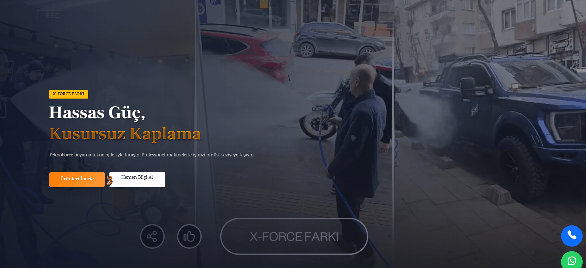

<h1 align="center">
  Selam 👋, Ben Helin Ergön
</h1>

  

## 📈 GitHub İstatistiklerim

  

  

## 💻 Hakkımda

C#, ASP.NET Core ve PHP teknolojileri ile backend geliştirme yapan bir yazılım geliştiricisiyim.  
Veri odaklı çalışan, yönetilebilir ve sürdürülebilir sistemler kurmaya odaklanıyorum.

Projelerimde yalnızca arayüz değil,  
👉 **veri akışı, sistem kurgusu ve yönetim paneli mimarisi** üzerine yoğunlaşıyorum.

Gerçek projeler geliştirerek:
- uçtan uca sistem kurma  
- veri modelleme  
- admin panel geliştirme  
konularında aktif deneyim kazandım :contentReference[oaicite:0]{index=0}

---

  

---

### 🛒 Öne Çıkan Projem

## 🔥 TeknoForce E-Commerce (Live Project)

🚀 Gerçek bir şirket için geliştirilmiş ve aktif kullanılan e-ticaret sistemi

## 🎬 Proje Demo

  

✔️ Admin panel + kullanıcı arayüzü  
✔️ Ürün / kategori / marka yönetimi  
✔️ Sipariş ve süreç yönetimi  
✔️ Yorum ve iletişim modülleri  
✔️ WhatsApp ve sosyal medya entegrasyonu  
✔️ Dinamik veri yönetimi  

📌 Bu projede:
- Entity Framework Core ile veri modeli kurdum  
- SQL Server üzerinde ilişkisel yapı oluşturdum  
- CRUD ve yönetim paneli altyapısını geliştirdim  
- Sistemi canlıya alarak uçtan uca süreci yönettim  

🌐 Canlı: http://www.teknoforceboya.com/  
💻 Repo: https://github.com/helinergon/TeknoForce-ECommerce  

---

## ⚙️ Teknik Yetkinlikler

### 🧠 Backend
- ASP.NET Core (Razor Pages & MVC)
- Entity Framework Core
- PHP
- RESTful API geliştirme

### 🗄️ Veritabanı
- Microsoft SQL Server
- MySQL
- İlişkisel veritabanı tasarımı
- Veri modelleme & CRUD işlemleri

### 🎨 Frontend
- HTML5 / CSS3 / JavaScript
- Bootstrap
- Responsive tasarım

### 🧩 Yazılım Prensipleri
- OOP
- SOLID
- Katmanlı mimari

---
## 🌐 Çoklu Teknoloji Deneyimi

C# (.NET) ve PHP gibi farklı backend teknolojileri ile çalışarak,  
farklı sistem yaklaşımlarını deneyimledim ve adapte olma yeteneğimi geliştirdim.
---

## 🧩 Projelerimde Dikkat Ettiklerim

✔️ Doğru veri modeli ve ilişkisel yapı  
✔️ Admin panel üzerinden tam kontrol  
✔️ Modüler ve sürdürülebilir yapı  
✔️ Gerçek kullanıcı senaryolarına uygun geliştirme  
✔️ Backend odaklı sistem tasarımı  

---

## 🧠 Bana Bu Teknolojiler Ne Kattı?

🔹 ASP.NET Core  
→ Sistem kurma ve backend mimarisi oluşturma  

🔹 Entity Framework Core  
→ Veri ilişkileri kurma ve yönetilebilir yapı geliştirme  

🔹 SQL Server / MySQL  
→ Gerçek veri ile çalışma ve performans odaklı düşünme  

🔹 PHP  
→ Farklı backend teknolojilerine adapte olabilme  

🔹 Frontend teknolojileri  
→ Backend’i kullanıcıya doğru şekilde yansıtabilme  

---

## 🎯 Hedefim

Daha kompleks ve ölçeklenebilir sistemler geliştirerek:

- Mikroservis mimarisi  
- Performans optimizasyonu  
- Büyük ölçekli backend sistemleri  

üzerine uzmanlaşmak.

---

## 📫 Bana Ulaş

🔗 LinkedIn: https://linkedin.com/in/helinergon  

---

  🚀 “Sadece kod yazmıyorum, sistem kuruyorum.”

